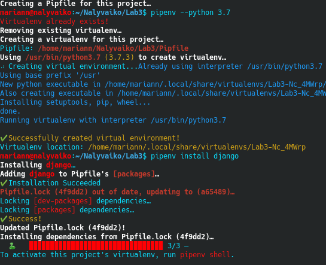
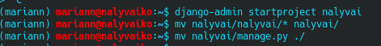
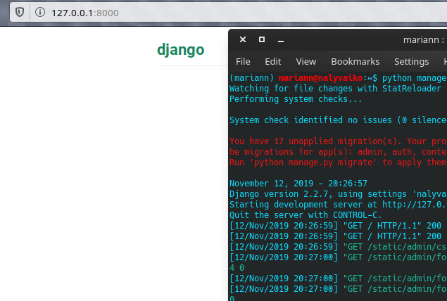
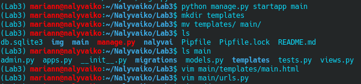
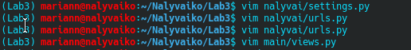
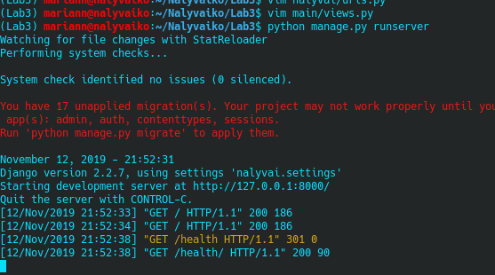
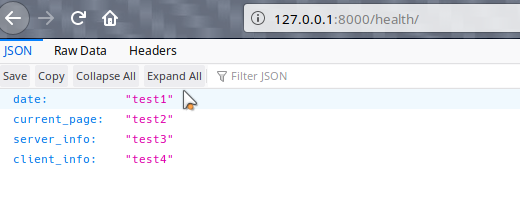
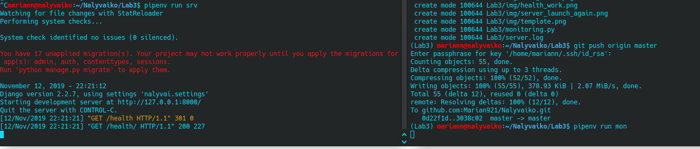
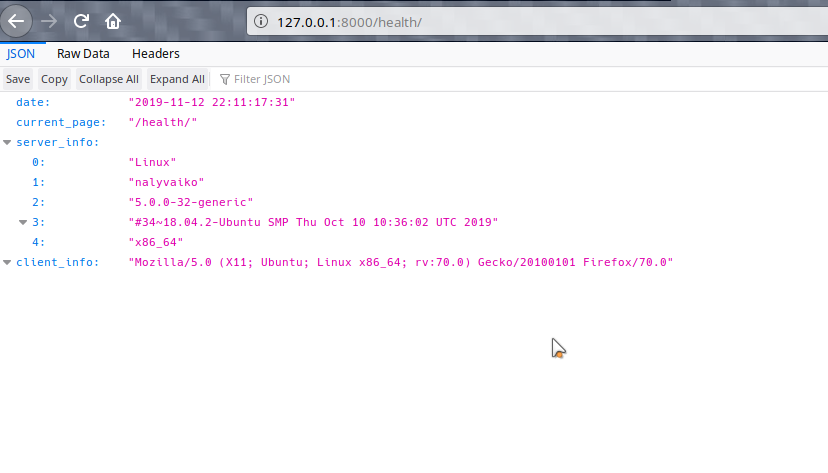

1. Встановлено середовище та фреймворк django:

2. Новий проект створив, файли на необхідний рівень перемістив:

3. Команду прописав та переконався,  ок:

4. закомітив зміни

5.
6. створив темплейт та файли:

7.
8. відредагував файли:

9. заповнив main/urls.py за зразком

10. запустив сервер:

11. Створив файл monitoring.py за зразком та встановив requests

12. див 10.

13. захист:
* модифікував function health
* дописав функціонал для виведення помилки
* зробив щоб програма працювала у бєкграундє
* спростив до неможливості роботу з середовищем (сервер - `pipenv run srv`, моніт. - `.. run mon`

14. запустив серверок - всьо ок:

