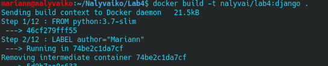
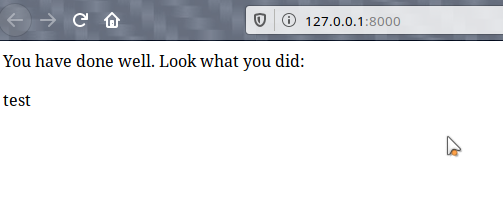

1. Got it
2. Got it -> commit
3. Yep!
4. Скачав імедж-темплейт для майбутніх контейнерів. Створив файл Dockerfile та замінив посилання.

5. Створив репозиторій: https://hub.docker.com/repository/docker/nalyvai/lab4
6. Виконав білд та пуш:

7. 
8. DONE!!!