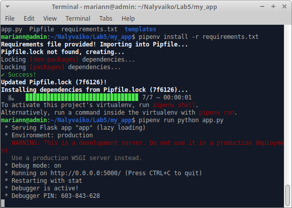
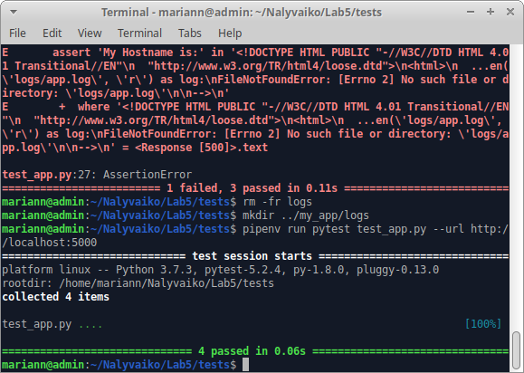
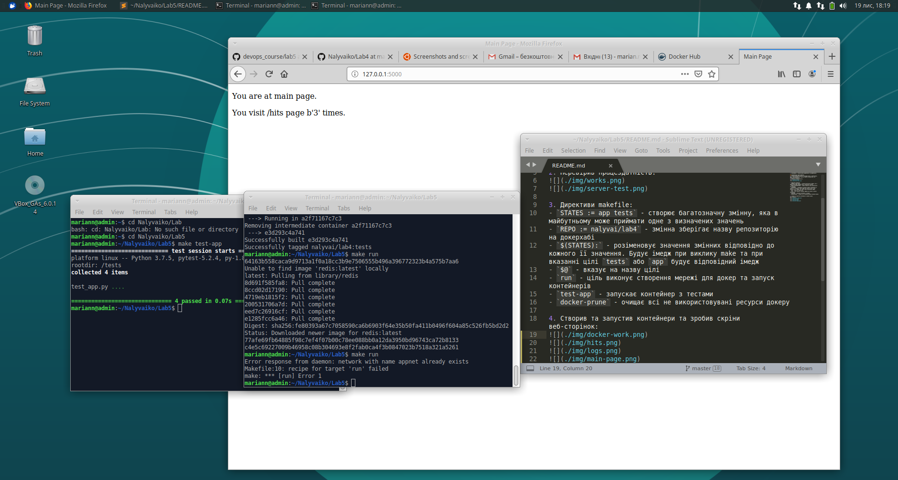
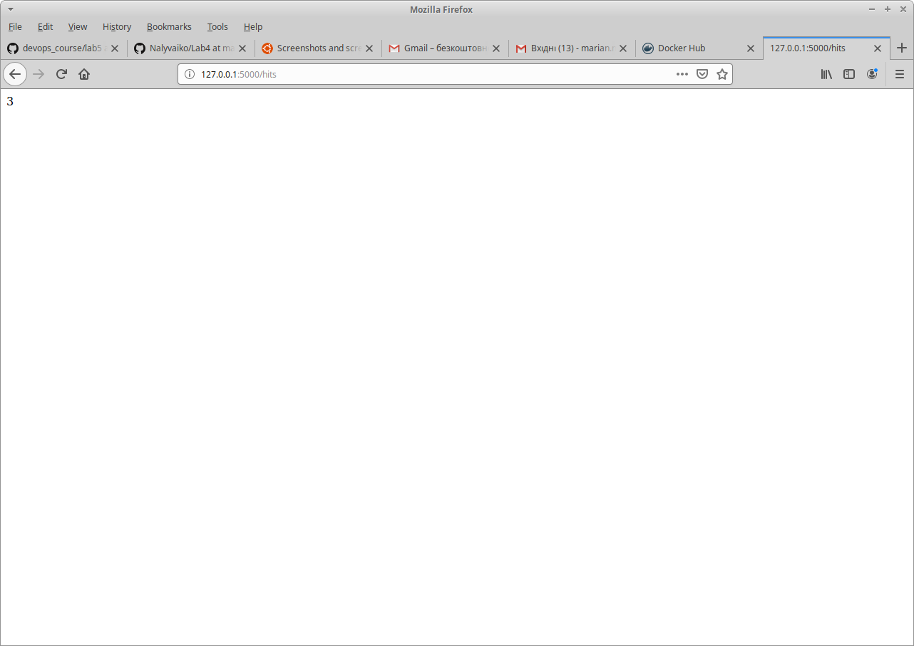
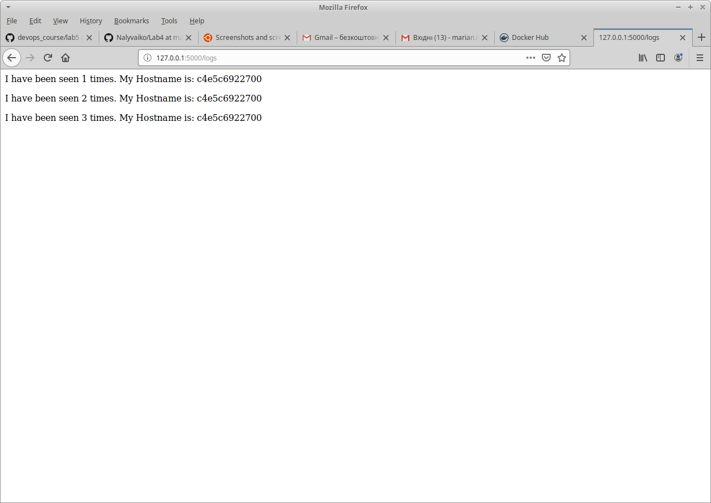
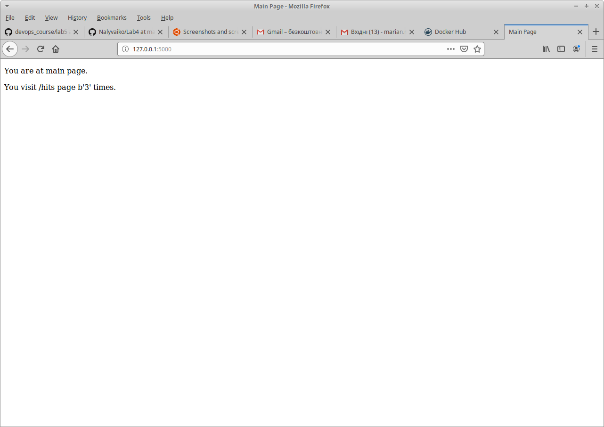
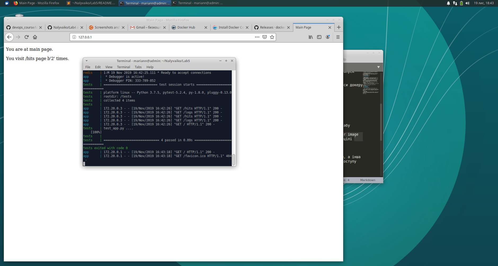

1. Ознайомився з теоритичними відомостями та документацією

## Автоматизація через Makefile
1. Створив необхідні папки та скопіював файли з репозиторію. Файл `requirements.txt` містить перелік залежностей, які необхідно встановити.
2. Перевірив працездатність:

3. Директиви makefile:
- `STATES := app tests` - створює багатозначну змінну, яка в майбутньому може приймати одне з визначених значень
- `REPO := nalyvai/lab4` - змінна зберігає назву репозиторію на докерхабі
- `$(STATES):` - розіменовує значення змінних відповідно до кожного її значення. Будує імедж при виклику make та при вказанні цілі `tests` або `app` будує відповідний імедж
- `$@` - вказує на назву цілі
- `run` - ціль виконує створення мережі для докер та запуск контейнерів
- `test-app` - запускає контейнер з тестами
- `docker-prune` - очищає всі не використовувані ресурси докеру

4. Створив та запустив контейнери та зробив скріни веб-сторінок:

5. команда `make docker-upload` завантажує імеджі до хабу

6. Видалив створені та закачені імеджі командою `docker image prune -a --force` та додав її до `Makefile` у вигляді цілі `delete-img`.

## Docker-compose
1. мережі: public, secret. Одна для взаємодії з хостом, а інша для взаємодії контейнерів між собою - до неї не буде доступу зовні.
2. все працює. потрібно зайти на локальну адресу (localhost) на порт за замовчуванням (80)

3. Виконав `docker-compose push`
4. На мою думку зручніше для створення та розгортання контейнерів краще використовувати docker-compose - він зручніший та має більше націлених засобів для роботи безпосередньо з докером. Також в порівнянні з файлом makefile потрібно прописувати менше різних аргументів і тд.

5. Створив `docker-compose.yml` для 4лабораторної, розмістив його в папці 4 лабораторної.